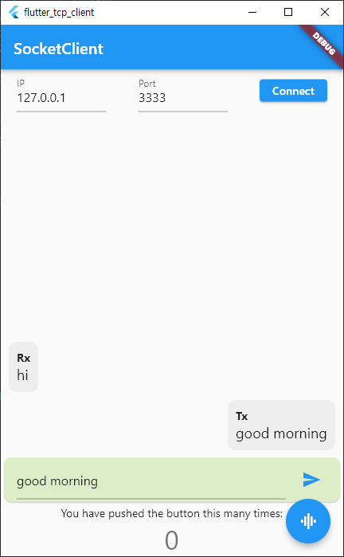

# flutter_tcp_client

TcpIp client socket sample code using "dart:io" API

## Getting Started

1. Run "TcpServer" app and configure its ip and port
   - example : 127.0.0.1, 3333
2. Run app
   - input ip address and port number
   - press "connect"
   - send message via press send button
     - Tx... will be display at window
   - send message from TcpServer tool
     - Rx... will be display
3. Add and modify what you need

- referenced code from "https://here4you.tistory.com/256?category=803195"
